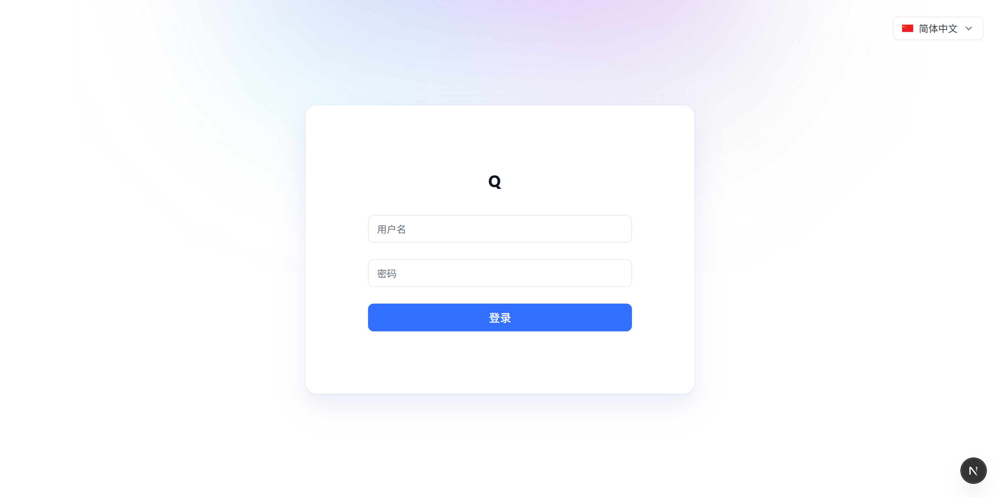
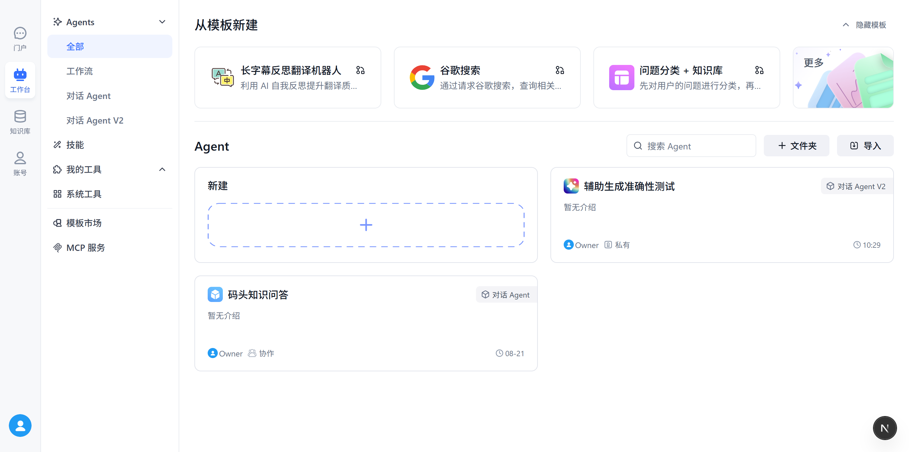
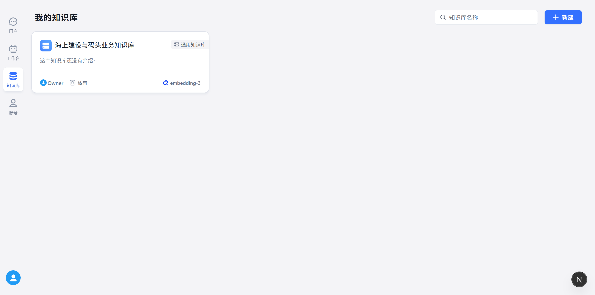
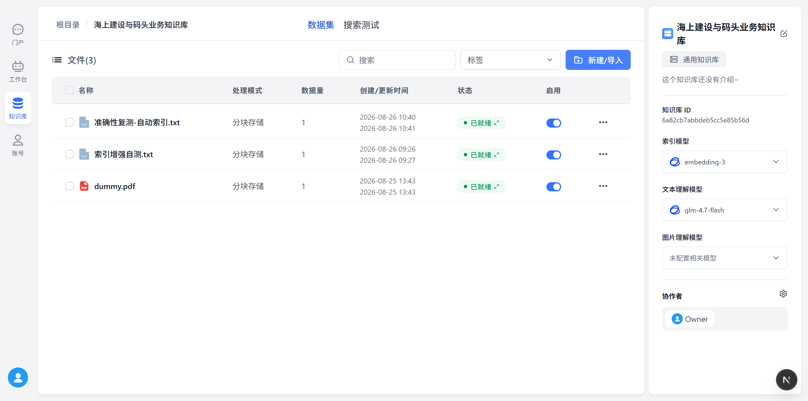
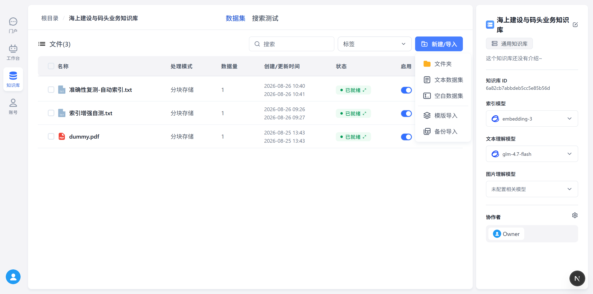
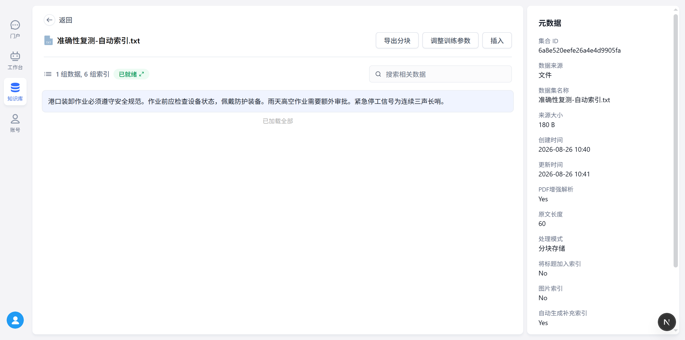
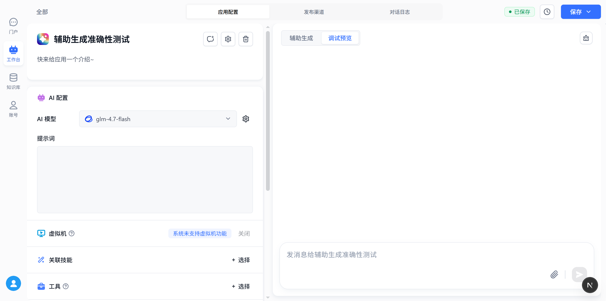
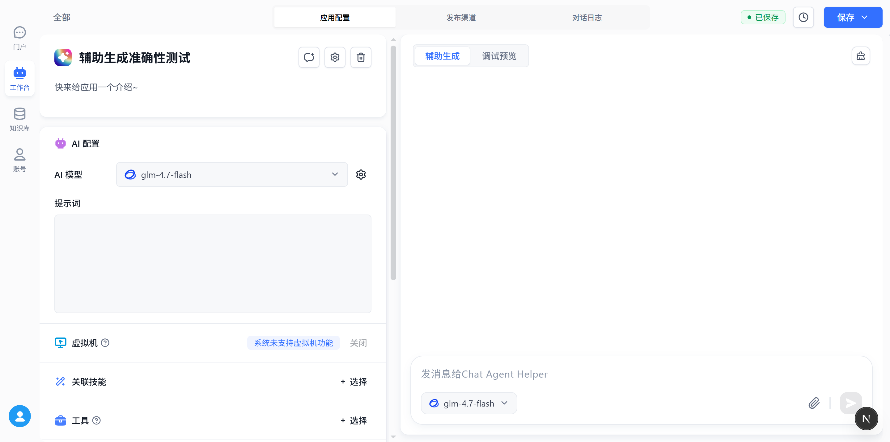

# Q 智能助手系统 · 员工培训手册（大白话版）

> 给谁看：公司里要用这个系统的同事（业务、运营、IT 都行）  
> 你会学会：登录 → 建知识库 → 丢文件 → 做 AI 助手 → 自己先试聊 → 交给别人用  
> 截图来自真实系统页面（本地演示环境，界面品牌显示为 **Q**）

---

## 0. 先搞懂三句话

1. **知识库** = 公司的“电子资料柜”。把文件丢进去，AI 以后才能按资料回答。  
2. **Agent（助手）** = 你雇的“数字员工”。你告诉它怎么说话、查哪份资料。  
3. **工作流程** 永远是：

```text
准备资料 → 导入知识库 → 创建助手并挂上知识库 → 右侧先自己试聊 → 没问题再给同事用
```

别一上来就指望 AI“什么都懂”。**没进知识库的内容，它基本只能瞎猜或说不知道。**

---

## 1. 怎么登录

打开系统地址后，会看到登录页：



**怎么做：**

1. 输入管理员给你的 **用户名**、**密码**  
2. 点蓝色 **登录**  
3. 右上角可以切换语言（一般用简体中文就行）

登录成功后，左边会出现四个大门：

| 入口 | 大白话 |
| --- | --- |
| 门户 | 对外/首页一类入口 |
| **工作台** | 做 AI 助手的地方（最常用） |
| **知识库** | 管文件、资料的地方（最常用） |
| 账号 | 个人/团队相关设置 |

---

## 2. 工作台：助手都住在这里

点左侧 **工作台**，进入 Agents 列表：



你看到的东西可以这么理解：

- **从模板新建**：懒人入口，先套一个现成模板再改  
- **新建**：从零做一个助手  
- 卡片上的类型：
  - **对话 Agent**：老一点的对话助手  
  - **对话 Agent V2**：新版，功能更全（**推荐新项目用 V2**）  
- **私有 / 协作**：只有你能用，还是团队一起改

**建议：**  
公司业务问答助手，优先建 **对话 Agent V2**。

---

## 3. 知识库：先把资料喂进去

点左侧 **知识库**，进入资料柜列表：



### 3.1 打开一个知识库

点进某个知识库（例如“海上建设与码头业务知识库”）：



右边是这个库的“身份证”：

- **索引模型**：负责把文字变成可检索的向量（一般选好别乱换）  
- **文本理解模型**：负责读懂、整理文本（自动补索引也会用到）  
- **图片理解模型**：没配的话，图片自动索引会不可用（正常）  
- **协作者**：谁能一起管这个库

中间表格是已经导入的文件。状态要看：

- **已就绪**（绿点）= 可以拿去问了  
- 还在“索引生成 / 自动索引生成”= 再等一会儿  

### 3.2 导入文件（别人给你一堆资料时）

点 **新建/导入**，会弹出“资料从哪来”：



常见选择：

| 来源 | 什么时候用 |
| --- | --- |
| **本地文件** | 对方给你 PDF、Word、TXT、Excel……直接上传 |
| **自定义文本** | 就想粘贴一小段文字 |
| 网页链接 | 读公开网页（静态页更稳） |
| 外链文件 | 有可下载的公开文件地址 |

**大白话流程：**

1. 选来源 → 确认  
2. 上传/粘贴内容  
3. 参数页里，建议勾上 **「自动生成补充索引」**（检索更容易命中）  
4. 一路下一步 → 上传  
5. 回到列表，等状态变成 **已就绪**

> 对方给你的最好是：**能复制文字的文件**。纯扫描图片 PDF，没配图片/OCR 能力时，系统“读”不出来。

### 3.3 导入成功后长什么样

点开某个已就绪的文件集合，能看到数据和索引：



你会看到类似：

- **1 组数据, 6 组索引**  
  - 1 组数据 ≈ 原文被切成的一块（或几块）内容  
  - 多组索引 ≈ 系统额外生成的“检索问法”，方便用户怎么问都能搜到  

右边元数据里：

- **自动生成补充索引 = Yes**：说明你开过这项增强  
- **图片索引 = No**：没开或环境不支持图片理解  

---

## 4. 创建 / 配置一个助手（Agent）

回到 **工作台** → 新建或点开已有助手，进入配置页：


页面左右分两块：

### 左边：教助手“怎么干活”

| 配置项 | 大白话 |
| --- | --- |
| **AI 模型** | 选哪个大脑来回答（贵的不一定必要，稳就好） |
| **提示词** | 员工手册。写清楚：你是谁、对谁说话、什么能答、什么不能瞎编 |
| **知识库** | 挂上刚才建好的资料柜（业务问答几乎必挂） |
| **工具** | 让助手去干“查天气、搜网页”这类动作（没有就先不选） |
| **关联技能** | 更整包的能力模块（初期可先空着） |
| **文件上传** | 聊天时用户能不能丢附件 |

**提示词怎么写（够用模板）：**

```text
你是本公司XX业务助手。
- 优先根据知识库回答；知识库没有就明确说“资料里没找到”。
- 不要编造制度、价格、承诺。
- 回答简洁，必要时列出步骤。
```

改完记得点右上角 **保存**。

### 右边：先自己当用户试聊

右边有两个页签：

#### A. 调试预览

就是正常跟助手聊天，看答得对不对。



#### B. 辅助生成（推荐小白用）

你可以用大白话跟“配置小助手”说话，让它帮你改左边的配置（提示词、挂哪个库、开不开上传等）。



例如你可以直接说：

> 帮我做成前台接待助手，礼貌简洁，挂上“海上建设与码头业务知识库”，不要乱加工具。

它配置好后，左边表单会跟着变。你再切回 **调试预览** 试聊验证。

> 注意：辅助生成在 **对话 Agent V2** 上更完整；老版对话 Agent 可能看不到这个页签。

顶部还有：

- **发布渠道**：做成链接/API 给别人用  
- **对话日志**：看大家聊过什么（排错、质检用）

---

## 5. 推荐的一条龙实操（培训现场照着点）

### 场景：做一个“公司制度问答助手”

1. **知识库** → 新建一个库，名字叫「公司制度」  
2. **新建/导入** → 本地文件 → 上传制度 PDF/Word  
3. 参数里勾上 **自动生成补充索引** → 等到 **已就绪**  
4. **工作台** → 新建 **对话 Agent V2**，名字叫「制度助手」  
5. 左边：写提示词 + **选择知识库「公司制度」** → 保存  
6. 右边 **调试预览**：问“年假怎么请？”看它是否引用资料  
7. 没问题后，去 **发布渠道** 生成分享链接发给同事  

---

## 6. 常见问题（同事最容易卡住的）

**Q1：助手老说不知道 / 答得很飘？**  
- 文件是不是还在处理，没到“已就绪”？  
- 助手有没有挂对知识库？  
- 提示词有没有要求“必须依据知识库、不许瞎编”？  

**Q2：别人丢给我一堆压缩包/扫描件怎么办？**  
- 先解压，挑出 PDF/Word/TXT/Excel  
- 扫描件尽量找可复制文字版，或配图片理解/OCR 能力后再导  

**Q3：自动补充索引要不要开？**  
- 业务问答：**建议开**  
- 纯表格逐行检索：按需要，不强求  

**Q4：图片自动索引灰的？**  
- 知识库右侧“图片理解模型”没配时就会禁用，不是坏了  

**Q5：辅助生成会不会乱挂不存在的工具？**  
- 系统会校验，假的工具 ID 写不进正式配置  

---

## 7. 权限与协作（公司多人用时）

- 知识库右侧有 **协作者**：把同事加成可阅读/可管理  
- Agent 也可以协作，避免所有人抢一个管理员账号  
- 敏感资料：单独建库，只给需要的人开权限  

（更高级的统一登录 SSO、全渠道对接飞书企微等，属于后续增强，不挡你们先把问答跑起来。）

---

## 8. 培训检查清单（验收用）

给每个学员发，做完打勾：

- [ ] 能登录系统  
- [ ] 能新建知识库并导入至少 1 个文件，等到“已就绪”  
- [ ] 知道“自动生成补充索引”在哪、为什么建议开  
- [ ] 能新建对话 Agent V2，挂上知识库并保存  
- [ ] 会用调试预览试聊  
- [ ] （可选）会用辅助生成改提示词/配置  
- [ ] 知道答不对时先查：是否就绪、是否挂库、提示词是否约束“别瞎编”

---

## 9. 截图目录

本手册配图均在同级目录 `images/`：

| 文件 | 内容 |
| --- | --- |
| `01-login.png` | 登录页 |
| `02-agents.png` | 工作台助手列表 |
| `03-datasets.png` | 知识库列表 |
| `04-dataset-detail.png` | 知识库详情与文件列表 |
| `05-import-source.png` | 导入来源选择 |
| `06-collection-data.png` | 集合数据与索引元数据 |
| `07-agent-edit.png` | 助手配置页 |
| `08-agent-helper.png` | 辅助生成 |
| `09-agent-debug.png` | 调试预览 |
| `10-account.png` | 账号相关页面 |

用 Markdown 阅读器或 VS Code / Typora 打开本文件即可正常看图。

---

**一句话总结给领导听：**  
这套系统就是“公司资料进知识库 + 做成可对话的 AI 助手”。员工会上传、会挂库、会试聊，就能上岗；其余高级能力以后再加。
